# 🏗️ Cricket Game Architecture

This document provides a comprehensive overview of the Cricket Game application architecture, including the development workflow, CI/CD pipeline, AWS infrastructure, and monitoring stack.

## 🎯 Architecture Overview

```mermaid
graph TB
    %% Development Section
    subgraph "🛠️ Development Environment"
        DEV[👨‍💻 Developer]
        IDE[🖥️ VS Code/IDE]
        LOCAL[🏠 Local Development<br/>React + Node.js]
        GIT[📦 Git Repository]
        
        DEV --> IDE
        IDE --> LOCAL
        LOCAL --> GIT
    end
    
    %% Source Control
    subgraph "📚 Source Control"
        GITHUB[🐙 GitHub Repository<br/>Main Branch]
        PR[🔄 Pull Request]
        
        GIT --> GITHUB
        GITHUB --> PR
    end
    
    %% CI/CD Pipeline
    subgraph "🚀 CI/CD Pipeline"
        JENKINS[🤖 Jenkins<br/>Build Server]
        SONAR[🔍 SonarQube<br/>Code Quality]
        TRIVY[🛡️ Trivy<br/>Security Scan]
        
        PR --> JENKINS
        JENKINS --> SONAR
        JENKINS --> TRIVY
    end
    
    %% Container Registry
    subgraph "📦 Container Registry"
        ECR[🐳 AWS ECR<br/>Docker Images]
        DOCKER[🐋 Docker Build]
        
        JENKINS --> DOCKER
        DOCKER --> ECR
    end
    
    %% AWS Infrastructure
    subgraph "☁️ AWS Cloud Infrastructure"
        
        subgraph "🌐 Networking"
            VPC[🏢 VPC<br/>10.0.0.0/16]
            PUB_SUB[🌍 Public Subnets<br/>3 AZs]
            PRIV_SUB[🔒 Private Subnets<br/>3 AZs]
            NAT[🚪 NAT Gateway]
            IGW[🌐 Internet Gateway]
            
            VPC --> PUB_SUB
            VPC --> PRIV_SUB
            PUB_SUB --> NAT
            PUB_SUB --> IGW
            PRIV_SUB --> NAT
        end
        
        subgraph "⚡ Load Balancing"
            ALB[⚖️ Application<br/>Load Balancer]
            TG[🎯 Target Groups]
            
            ALB --> TG
        end
        
        subgraph "🎮 EKS Cluster"
            EKS[☸️ EKS Control Plane]
            NODES[🖥️ Worker Nodes<br/>t3.medium]
            PODS[📦 Application Pods<br/>Cricket Game]
            HPA[📈 Horizontal Pod<br/>Autoscaler]
            
            EKS --> NODES
            NODES --> PODS
            PODS --> HPA
        end
        
        subgraph "💾 Storage"
            EBS[💿 EBS Volumes<br/>Persistent Storage]
            PVC[📁 Persistent Volume<br/>Claims]
            
            EBS --> PVC
            PVC --> PODS
        end
        
        subgraph "🗄️ Database"
            RDS[🐘 RDS PostgreSQL<br/>Database]
            DB_SUB[🗂️ DB Subnet Group]
            
            RDS --> DB_SUB
        end
        
        subgraph "🔐 Security"
            IAM[👤 IAM Roles<br/>& Policies]
            SG[🛡️ Security Groups]
            SSL[🔒 SSL/TLS<br/>Certificates]
            
            IAM --> EKS
            SG --> ALB
            SG --> RDS
            SSL --> ALB
        end
    end
    
    %% Monitoring Stack
    subgraph "📊 Monitoring & Observability"
        PROMETHEUS[📈 Prometheus<br/>Metrics Collection]
        GRAFANA[📊 Grafana<br/>Dashboards]
        ALERTS[🚨 Alertmanager<br/>Notifications]
        LOGS[📝 Container Logs]
        
        PODS --> PROMETHEUS
        PROMETHEUS --> GRAFANA
        PROMETHEUS --> ALERTS
        PODS --> LOGS
    end
    
    %% Users
    subgraph "👥 End Users"
        USERS[🌍 Global Users<br/>Web Browsers]
        MOBILE[📱 Mobile Devices]
        DESKTOP[🖥️ Desktop Browsers]
        
        USERS --> MOBILE
        USERS --> DESKTOP
    end
    
    %% DNS & CDN
    subgraph "🌐 DNS & Domain"
        ROUTE53[🗺️ Route 53<br/>DNS Management]
        DOMAIN[🌐 cricket-game<br/>.yourdomain.com]
        
        ROUTE53 --> DOMAIN
    end
    
    %% External Services
    subgraph "🔌 External Integrations"
        SLACK[💬 Slack<br/>Notifications]
        EMAIL[📧 Email Alerts]
        
        ALERTS --> SLACK
        ALERTS --> EMAIL
    end
    
    %% Connections
    ECR --> EKS
    TG --> PODS
    DOMAIN --> ALB
    USERS --> ROUTE53
    
    %% Styling
    classDef awsService fill:#FF9900,stroke:#FF9900,stroke-width:2px,color:#fff
    classDef k8sService fill:#326CE5,stroke:#326CE5,stroke-width:2px,color:#fff
    classDef devTool fill:#22C55E,stroke:#22C55E,stroke-width:2px,color:#fff
    classDef monitoring fill:#8B5CF6,stroke:#8B5CF6,stroke-width:2px,color:#fff
    classDef security fill:#EF4444,stroke:#EF4444,stroke-width:2px,color:#fff
    classDef user fill:#3B82F6,stroke:#3B82F6,stroke-width:2px,color:#fff
    
    class VPC,PUB_SUB,PRIV_SUB,NAT,IGW,ALB,TG,RDS,DB_SUB,ECR,ROUTE53 awsService
    class EKS,NODES,PODS,HPA,PVC kubernetes
    class JENKINS,GITHUB,DOCKER,IDE,LOCAL devTool
    class PROMETHEUS,GRAFANA,ALERTS,LOGS monitoring
    class IAM,SG,SSL,TRIVY security
    class USERS,MOBILE,DESKTOP user
```

## 🏗️ Component Architecture

```mermaid
graph TB
    %% Frontend Components
    subgraph "🎮 Frontend (React + TypeScript)"
        REACT[⚛️ React 18<br/>Component Tree]
        VITE[⚡ Vite<br/>Build Tool]
        TAILWIND[🎨 Tailwind CSS<br/>Styling]
        SHADCN[🧩 shadcn/ui<br/>Components]
        
        REACT --> SHADCN
        REACT --> TAILWIND
        VITE --> REACT
    end
    
    %% Game Components
    subgraph "🏏 Game Components"
        MAIN_MENU[🏠 Main Menu<br/>Game Mode Selection]
        TEAM_SELECT[👥 Team Selection<br/>4 International Teams]
        TOSS[🪙 Toss System<br/>Heads/Tails]
        BATTING[🏏 Batting Interface<br/>Shot Selection 1-6]
        BOWLING[⚾ Bowling Interface<br/>Ball Selection 1-6]
        SCOREBOARD[📊 Live Scoreboard<br/>Real-time Updates]
        EFFECTS[✨ Visual Effects<br/>4s, 6s, Outs]
        RESULTS[🏆 Match Results<br/>Winner Display]
        
        MAIN_MENU --> TEAM_SELECT
        TEAM_SELECT --> TOSS
        TOSS --> BATTING
        TOSS --> BOWLING
        BATTING --> SCOREBOARD
        BOWLING --> SCOREBOARD
        SCOREBOARD --> EFFECTS
        SCOREBOARD --> RESULTS
    end
    
    %% Backend Services
    subgraph "🖥️ Backend (Node.js + Express)"
        EXPRESS[🚀 Express 5<br/>API Server]
        HEALTH[❤️ Health Checks<br/>/api/health]
        STATS[📈 Game Statistics<br/>/api/game-stats]
        MIDDLEWARE[🔧 Middleware<br/>CORS, Body Parser]
        
        EXPRESS --> HEALTH
        EXPRESS --> STATS
        EXPRESS --> MIDDLEWARE
    end
    
    %% Data Layer
    subgraph "💾 Data Management"
        SQLITE[🗃️ SQLite Database<br/>Local Storage]
        KYSELY[🔍 Kysely ORM<br/>Query Builder]
        STATE[🔄 Game State<br/>Management]
        
        KYSELY --> SQLITE
        STATE --> KYSELY
    end
    
    %% Game Logic
    subgraph "🎯 Game Logic Engine"
        TEAMS[👥 Team Management<br/>11 Players Each]
        PLAYERS[🏃‍♂️ Player Statistics<br/>Individual Scores]
        INNINGS[📋 Innings Logic<br/>Batting Order]
        SCORING[🎯 Scoring System<br/>Runs & Wickets]
        AI[🤖 AI Opponent<br/>Smart Decisions]
        
        TEAMS --> PLAYERS
        PLAYERS --> INNINGS
        INNINGS --> SCORING
        SCORING --> AI
    end
    
    %% Connections
    REACT --> EXPRESS
    EXPRESS --> STATE
    TEAMS --> TEAM_SELECT
    SCORING --> SCOREBOARD
    AI --> BOWLING
    
    %% Styling
    classDef frontend fill:#61DAFB,stroke:#61DAFB,stroke-width:2px,color:#000
    classDef backend fill:#68A063,stroke:#68A063,stroke-width:2px,color:#fff
    classDef game fill:#FF6B6B,stroke:#FF6B6B,stroke-width:2px,color:#fff
    classDef data fill:#4ECDC4,stroke:#4ECDC4,stroke-width:2px,color:#fff
    classDef logic fill:#45B7D1,stroke:#45B7D1,stroke-width:2px,color:#fff
    
    class REACT,VITE,TAILWIND,SHADCN frontend
    class EXPRESS,HEALTH,STATS,MIDDLEWARE backend
    class MAIN_MENU,TEAM_SELECT,TOSS,BATTING,BOWLING,SCOREBOARD,EFFECTS,RESULTS game
    class SQLITE,KYSELY,STATE data
    class TEAMS,PLAYERS,INNINGS,SCORING,AI logic
```

## 🔄 Data Flow Architecture

```mermaid
sequenceDiagram
    participant U as 👥 User
    participant F as ⚛️ Frontend
    participant A as 🚀 API
    participant D as 💾 Database
    participant K as ☸️ Kubernetes
    participant M as 📊 Monitoring
    
    Note over U,M: 🎮 Game Session Flow
    
    U->>F: 1. Select Game Mode
    F->>F: 2. Load Team Selection
    U->>F: 3. Choose Teams
    F->>F: 4. Initialize Toss
    U->>F: 5. Call Heads/Tails
    F->>F: 6. Generate Random Result
    
    Note over U,M: 🏏 Gameplay Loop
    
    loop Every Ball
        U->>F: 7. Select Shot (1-6)
        F->>F: 8. Generate Bowl (AI/Player)
        F->>F: 9. Calculate Result
        alt Runs Scored
            F->>F: 10. Update Score
            F->>F: 11. Show Effect (4/6/Other)
        else Out
            F->>F: 12. Next Batsman
            F->>F: 13. Show Out Effect
        end
        F->>D: 14. Save Game State
        D->>F: 15. Confirm Save
    end
    
    Note over U,M: 📊 Monitoring & Health
    
    A->>K: Health Check
    K->>A: Status OK
    K->>M: Metrics
    M->>M: Process Data
    
    Note over U,M: 🏆 Game Completion
    
    F->>F: Check Win Condition
    F->>U: Display Results
    U->>F: Play Again?
    F->>F: Reset Game State
```

## 📋 Technology Stack Details

### 🎨 Frontend Stack
- **React 18** - Modern UI framework with hooks
- **TypeScript** - Type-safe JavaScript
- **Vite** - Fast build tool and dev server
- **Tailwind CSS** - Utility-first CSS framework
- **shadcn/ui** - Beautiful, accessible components
- **Lucide Icons** - Consistent icon library

### 🖥️ Backend Stack
- **Node.js 18** - JavaScript runtime
- **Express 5** - Web application framework
- **TypeScript** - Type safety for server code
- **SQLite** - Lightweight database
- **Kysely** - Type-safe SQL query builder

### ☁️ Cloud Infrastructure
- **AWS EKS** - Managed Kubernetes service
- **AWS ECR** - Container registry
- **AWS VPC** - Network isolation
- **AWS ALB** - Application load balancer
- **AWS RDS** - Managed database service
- **AWS Route 53** - DNS management

### 🔧 DevOps Tools
- **Docker** - Containerization
- **Kubernetes** - Container orchestration
- **Jenkins** - CI/CD automation
- **SonarQube** - Code quality analysis
- **Trivy** - Security vulnerability scanning
- **Terraform** - Infrastructure as code

### 📊 Monitoring Stack
- **Prometheus** - Metrics collection
- **Grafana** - Visualization dashboards
- **Alertmanager** - Alert routing
- **Container Logs** - Application logging

## 🔐 Security Architecture

```mermaid
graph LR
    %% Security Layers
    subgraph "🛡️ Security Layers"
        
        subgraph "🌐 Network Security"
            WAF[🛡️ Web Application<br/>Firewall]
            SG[🔒 Security Groups<br/>Port 80/443 only]
            NACL[🚧 Network ACLs<br/>Subnet Protection]
        end
        
        subgraph "🔐 Identity & Access"
            IAM[👤 IAM Roles<br/>Least Privilege]
            RBAC[🎭 Kubernetes RBAC<br/>Role-Based Access]
            SA[🤖 Service Accounts<br/>Pod Identity]
        end
        
        subgraph "📦 Container Security"
            SCAN[🔍 Image Scanning<br/>Trivy + ECR]
            NONROOT[👤 Non-root User<br/>Security Context]
            SECRETS[🔑 Kubernetes Secrets<br/>Encrypted Storage]
        end
        
        subgraph "🔒 Data Protection"
            TLS[🔐 TLS Encryption<br/>In Transit]
            ENCRYPT[🔒 Encryption<br/>At Rest]
            BACKUP[💾 Automated Backups<br/>Point-in-time Recovery]
        end
        
        subgraph "👁️ Monitoring & Audit"
            AUDIT[📋 Audit Logs<br/>API Server]
            MONITOR[👁️ Security Monitoring<br/>Anomaly Detection]
            ALERTS[🚨 Security Alerts<br/>Real-time Notifications]
        end
    end
    
    %% Styling
    classDef security fill:#EF4444,stroke:#EF4444,stroke-width:2px,color:#fff
    class WAF,SG,NACL,IAM,RBAC,SA,SCAN,NONROOT,SECRETS,TLS,ENCRYPT,BACKUP,AUDIT,MONITOR,ALERTS security
```

## 📈 Scalability & Performance

### 🚀 Performance Optimizations
- **Horizontal Pod Autoscaling** - 2-10 pods based on CPU/memory
- **Application Load Balancer** - Distributes traffic across pods
- **CDN Integration** - Static asset caching
- **Database Connection Pooling** - Efficient resource usage
- **Image Optimization** - Multi-stage Docker builds

### 📊 Monitoring Metrics
- **Response Time** - < 100ms API calls
- **Availability** - 99.9% uptime SLA
- **Throughput** - Concurrent user handling
- **Resource Usage** - CPU, memory, storage monitoring
- **Error Rates** - Application and infrastructure errors

### 🔄 Disaster Recovery
- **Multi-AZ Deployment** - High availability across zones
- **Automated Backups** - Database and persistent volume backups
- **Health Checks** - Automatic pod restarts on failure
- **Rolling Updates** - Zero-downtime deployments
- **Rollback Capability** - Quick reversion to previous versions

This architecture ensures a robust, scalable, and secure cricket game that can handle production workloads while maintaining excellent user experience and operational reliability.
